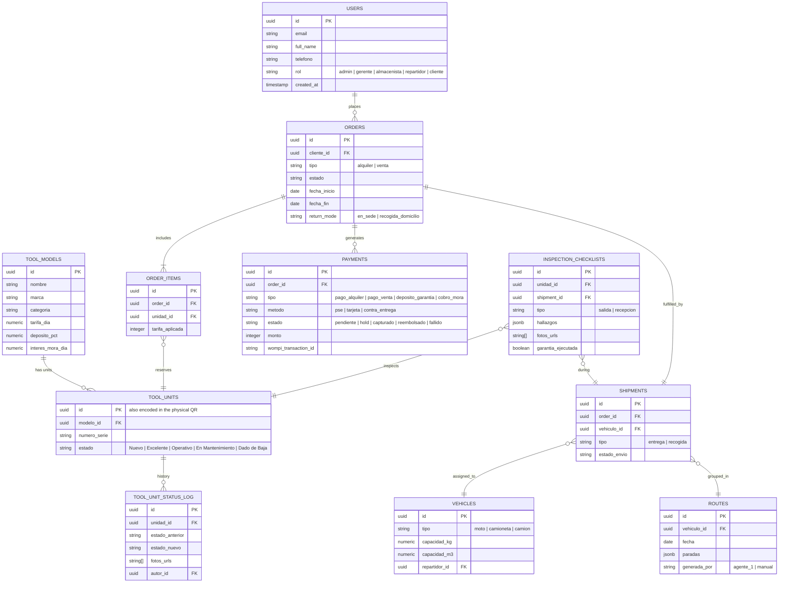

# System Design Specification: ToolBox JL Platform
**Document Version:** 2.0.0
**Status:** Approved for Implementation — Aligned with `01_Documento_de_Arquitectura`, `03_TRD` and `06_Esquema_Backend` (ToolBox JL documentation package, v1.0/v1.1)
**Target Architecture:** Clean Architecture / Domain-Driven Design (DDD)
**Tech Stack:** Node.js / NestJS (Web API), Angular micro-frontends (Native Federation) / PWA, PostgreSQL via **Supabase** (Auth + Storage + Realtime + Row-Level Security), **Vercel** (frontend hosting) + **Railway** (backend API & workers), **Claude (Anthropic) + Vercel AI SDK** (agent orchestration), **LiveKit Agents + Deepgram (STT) + ElevenLabs (TTS)** (real-time voice), **Wompi** (payments, sandbox mode)

> **Alignment note (v2.0.0):** This revision replaces the original draft's .NET 8 / Azure-centric stack with the managed-services, AI-native stack decided for this project. See §9 for a full changelog of what changed and why.

---

## 1. Executive Summary & System Context

**ToolBox JL** is a high-performance web platform for renting and selling electric power tools for construction, carpentry, and heavy-duty industries, built around three differentiators: unit-level QR traceability, AI-driven logistics, and conversational AI agents (a WhatsApp voice assistant and an on-site voice concierge).

The platform covers:
- Real-time catalog browsing, quoting and reservation (rental or direct sale).
- Serialized asset lifecycle tracking via unique QR codes per physical unit.
- Payment processing with security-deposit holds and split payments (Wompi, sandbox).
- Field delivery/return workflows (PWA, offline-first) with photo-evidenced inspection checklists.
- Automated late-fee billing.
- Three autonomous AI agents: nightly route optimization, a bidirectional WhatsApp voice assistant, and a real-time voice concierge embedded in the customer portal.

Delivery is phased: **Phase 1 (MVP)** covers the full commercial/logistics cycle without the AI agents; **Phase 2** adds the three agents and advanced BI. See the Plan de Implementación document for the sprint-by-sprint breakdown.

---

## 2. High-Level Architecture (C4 Model — Container View)

The architecture follows **Clean Architecture** and **DDD**, implemented as a single modular NestJS service (ready for future extraction into microservices) plus a set of managed platform services rather than self-hosted containers.

```
+-----------------------------------------------------------------------------+
|                              CHANNELS / CLIENTS                             |
|  +------------------------+  +------------------------+  +----------------+ |
|  | Customer Web (Portal + |  | Warehouse / Courier PWA |  | Customer via   | |
|  | Voice Concierge Widget)|  | (offline-first)         |  | WhatsApp       | |
|  +------------------------+  +------------------------+  +----------------+ |
+------------------+-----------------------+--------------------+-------------+
                    | HTTPS                | HTTPS               | Messages
+-------------------v-----------------------v--------------------v-----------+
|                 FRONTEND — Angular Shell + Micro-Frontends (Vercel)         |
|   Portal Cliente  ·  Panel Admin/Gerente  ·  PWA Logística                  |
+------------------------------------+----------------------------------------+
                                     | REST / JSON (OpenAPI 3.0)
+------------------------------------v----------------------------------------+
|                    BACKEND — NestJS API · Clean Architecture (Railway)      |
|  +----------------+ +----------------+ +----------------+ +---------------+ |
|  | CatalogModule  | | InventoryModule| | PricingModule  | | PaymentsModule| |
|  +----------------+ +----------------+ +----------------+ +---------------+ |
|  +----------------+ +----------------+ +----------------+ +---------------+ |
|  | FleetModule    | | LogisticsModule| | InspectionModule| | AnalyticsModule| |
|  +----------------+ +----------------+ +----------------+ +---------------+ |
|  +----------------+ +----------------+                                     |
|  | AuthModule     | | AgentsModule   |    Workers / Cron: nightly routing  |
|  +----------------+ +----------------+    job, mora job, webhook retries   |
+------------------------------------+----------------------------------------+
                                     |
        +----------------------------+----------------------------+
        |                            |                             |
+-------v--------+          +--------v---------+          +--------v---------+
| AI AGENTS LAYER |          | DATA — Supabase  |          | EXTERNAL SERVICES|
| Orchestration:   |          | Postgres · Auth  |          | Wompi (payments, |
| Claude + Vercel  |          | Storage · Realtime|         | sandbox)         |
| AI SDK           |          | + Row-Level      |          | WhatsApp Business|
| Voice pipeline:  |          | Security         |          | Cloud API (Meta) |
| LiveKit Agents + |          +------------------+          +------------------+
| Deepgram (STT) + |
| ElevenLabs (TTS) |
+------------------+
```

Full container diagram with data-flow labels: see `01_Documento_de_Arquitectura_ToolBoxJL.docx`, Figure 1.

---

## 3. Core Bounded Contexts & Domain Model

Each module below is a NestJS module internally layered as `domain/ → application/ → infrastructure/ → interface/` (Clean Architecture). Modules map directly to the ERS functional requirement (RF) groups.

1. **CatalogModule / InventoryModule** — tool models (`ToolModel`) and serialized physical units (`ToolUnit`: `Nuevo → Excelente/Operativo → En Mantenimiento → Dado de Baja`), QR generation and scanning, unit status history. *(RF-1.1–RF-1.4)*
2. **PricingModule** — quoting engine: daily/weekly rate, logistics surcharge by weight/zone, configurable security-deposit percentage. *(RF-2.1, RF-3.2)*
3. **PaymentsModule** — Wompi integration (PSE, card with pre-authorization hold, cash-on-delivery), split payments, deposit capture/refund. *(RF-2.2–RF-2.4)*
4. **FleetModule / LogisticsModule** — vehicles (type, weight/volume capacity, zones), shipments, real-time shipment tracking (Supabase Realtime), daily routes. *(RF-3.1, RF-3.3)*
5. **InspectionModule** — delivery/return checklists with photo evidence, triggers deposit execution on damage; late-fee calculation job. *(RF-4.1–RF-4.3)*
6. **AnalyticsModule** — revenue, ROI per tool, inventory utilization, courier productivity KPIs.
7. **AuthModule** — Supabase Auth (JWT, Google OAuth) plus a custom WhatsApp OTP 2FA step (not natively provided by Supabase Auth), RBAC guards for the five roles (`admin`, `gerente`, `almacenista`, `repartidor`, `cliente`).
8. **AgentsModule** — tool-calling surface consumed by the three AI agents (§7); wraps the same use cases exposed to human users, so agent actions and human actions share identical business rules.

A shared kernel (`SharedKernel`) holds cross-cutting value objects: `Dinero` (COP integer), `Zona`, `Rol`.

---

## 4. Database Schema & Supabase Row-Level Security (RLS)

### 4.1 ER Diagram (Entities)



Full field-level data dictionary: see `06_Esquema_Backend_ToolBoxJL.docx`, §3.2.

### 4.2 Supabase Row-Level Security (RLS) Policies

```sql
-- Enable RLS on orders
ALTER TABLE public.orders ENABLE ROW LEVEL SECURITY;

-- Customers can view only their own orders
CREATE POLICY "Users can view own orders"
ON public.orders
FOR SELECT
USING (auth.uid() = cliente_id);

-- Operational staff can view all orders
CREATE POLICY "Staff can view all orders"
ON public.orders
FOR SELECT
USING (
  EXISTS (
    SELECT 1 FROM public.users
    WHERE users.id = auth.uid()
    AND users.rol IN ('admin', 'gerente', 'almacenista', 'repartidor')
  )
);

-- Customers can create their own orders
CREATE POLICY "Users can insert own orders"
ON public.orders
FOR INSERT
WITH CHECK (auth.uid() = cliente_id);

-- tool_unit_status_log and inspection_checklists are append-only audit trails
ALTER TABLE public.tool_unit_status_log ENABLE ROW LEVEL SECURITY;
ALTER TABLE public.inspection_checklists ENABLE ROW LEVEL SECURITY;

CREATE POLICY "Staff can insert status log entries"
ON public.tool_unit_status_log
FOR INSERT
WITH CHECK (
  EXISTS (
    SELECT 1 FROM public.users
    WHERE users.id = auth.uid()
    AND users.rol IN ('admin', 'almacenista', 'repartidor')
  )
);
-- No UPDATE/DELETE policy is defined on either table: rows are immutable once inserted.
```

> All transactional writes go through the NestJS API, which enforces business rules (Application layer) before persisting — the frontend never writes directly to these tables via the Supabase client; RLS is the defense-in-depth layer, not the primary write path.

---

## 5. Key API Specifications (RESTful, OpenAPI 3.0)

| Method | Endpoint | Description | Auth Required |
| :--- | :--- | :--- | :--- |
| `GET` | `/catalog/search` | Search & filter tool catalog (also used by Agent 3) | Public |
| `GET` | `/catalog/models/{id}` | Model detail sheet | Public |
| `POST` | `/inventory/models` | Register a tool model | Admin |
| `POST` | `/inventory/units` | Register a physical unit + generate QR | Almacenista, Admin |
| `GET` | `/inventory/units/{id}` | Unit sheet on QR scan | Almacenista, Repartidor |
| `PATCH` | `/inventory/units/{id}/status` | Update unit status / life-cycle log | Almacenista, Repartidor |
| `POST` | `/orders/quote` | Quote (rate + surcharge + deposit) | Cliente |
| `POST` | `/orders` | Create an order (rental or sale) | Cliente |
| `POST` | `/orders/{id}/pay` | Start payment via Wompi | Cliente |
| `POST` | `/orders/{id}/confirm-cod-payment` | Confirm cash-on-delivery payment | Repartidor |
| `POST` | `/rentals/extend` | Extend an active rental | Cliente, Agent 2 (tool calling) |
| `GET` | `/inventory/check-availability` | Availability by date range | Agent 2/3 (tool calling), Cliente |
| `POST` | `/fleet/vehicles` | Register a vehicle | Admin |
| `GET` | `/logistics/pending-orders` | Confirmed orders without an assigned route | Agent 1 (tool calling), Admin |
| `POST` | `/logistics/assign-routes` | Publish the day's routes | Agent 1 (tool calling), Admin |
| `GET` | `/logistics/shipments` | Real-time shipment tracking panel | Gerente, Admin |
| `POST` | `/inspections` | Record delivery/return checklist | Almacenista, Repartidor |
| `GET` | `/billing/mora/{orderId}` | Late-fee invoice for an order | Cliente, Admin |
| `POST` | `/cart/add-item` | Add an item to the cart | Cliente, Agent 3 (tool calling) |
| `GET` | `/analytics/revenue` \| `/roi` \| `/utilization` \| `/delivery-productivity` | Business dashboards | Gerente, Admin |

Full contract, including request/response DTOs, is generated from NestJS decorators (`@nestjs/swagger`) and published at `/docs`; the table above is the human-readable summary — see `06_Esquema_Backend_ToolBoxJL.docx`, §4 for the version grouped by module.

---

## 6. Business Workflows & State Machines

### 6.1 Tool Unit State Machine

`Nuevo` → `Excelente / Operativo` → `Reservada` → *(entregada / en uso)* → `Excelente / Operativo` (on clean return) — with side transitions to `En Mantenimiento` (repairable damage) and the terminal state `Dado de Baja` (total loss, theft, or unrepairable damage — see `Contrato Estándar de Alquiler` §7).

### 6.2 Rental Lifecycle Sequence

```
Cliente              Portal / API              Wompi              Almacenista/Repartidor
   |                       |                      |                         |
   |--- Quote (RF-2.1) --->|                      |                         |
   |--- Create Order ----->|                      |                         |
   |                       |--- Hold Deposit ---->|                         |
   |                       |<-- Deposit Held -----|                         |
   |<-- Order Confirmed ---|                      |                         |
   |                       |                      |                         |
   |============= Assignment (Agent 1 / manual, see AppFlow §8) ===========|
   |                       |                      |                         |
   |                       |<---------------- Scan QR & Deliver ------------|
   |                       |--- Set "Reservada"->"Entregada" -------------->|
   |                       |                      |                         |
   |============================ Tool in use =====================================|
   |                       |                      |                         |
   |<== Agent 2: 24h voice reminder + optional extension (AppFlow §6) =========|
   |                       |                      |                         |
   |                       |<---------------- Inspect Return ----------------|
   |                       |--- Record Checklist / Damage ----------------->|
   |                       |--- Calculate Mora if late (RF-4.3) ----------->|
   |                       |--- Release / Capture Deposit -------->|        |
   |                       |<-- Settlement Done -------------------|        |
```

Full step-by-step actor/component table for this and 7 other flows (direct sale, auth+2FA, QR unit life cycle, each of the 3 agents, edge cases): see `05_AppFlow_ToolBoxJL.docx`.

---

## 7. AI Agents Architecture

Unlike the original draft (a single generic "Notification & AI" box), the platform ships **three** distinct autonomous agents, all orchestrated with **Claude (Anthropic) via the Vercel AI SDK** using typed tool calling against the same `AgentsModule` endpoints a human user would call.

| Agent | Trigger | Tools (endpoints) | Voice stack |
| :--- | :--- | :--- | :--- |
| **Agent 1 — Route Scheduler** | Nightly cron (Railway Workers) | `GET /logistics/pending-orders` → `POST /logistics/assign-routes` | n/a |
| **Agent 2 — WhatsApp Assistant** | 24h-before reminder job + inbound WhatsApp webhook (text/voice) | `GET /inventory/check-availability`, `POST /rentals/extend` | Deepgram (STT) + ElevenLabs (TTS) over per-message audio files (WhatsApp Business Cloud API, Meta) |
| **Agent 3 — Web Voice Concierge** | Customer opens the portal's floating voice widget | `GET /catalog/search`, `POST /cart/add-item` | LiveKit Agents (real-time WebRTC session) + Deepgram (streaming STT) + ElevenLabs (streaming TTS) |

Target end-to-end voice latency: **< 2.5 s** (see §8, NFR-2). Full specification (guardrails, failure handling, example conversation): see `03_TRD_ToolBoxJL.docx`, §4.

---

## 8. Non-Functional Requirements (NFRs)

| NFR | Requirement | How it's met on this stack |
| :--- | :--- | :--- |
| Performance | p95 < 200 ms for CRUD API calls | Postgres indexes on high-frequency lookup keys (SKU, unit status, zone); Supabase connection pooling. *(No dedicated cache layer — e.g. Redis — is part of the current decisions; add one only if load testing shows it's needed.)* |
| Voice latency | < 2.5 s end-to-end (Agent 2 & 3) | Streaming STT/TTS via LiveKit Agents instead of per-turn request/response. |
| Availability | ≥ 99.5% during operating hours | Railway auto-restart for the API; Vercel global CDN for the frontend. |
| Offline capability (PWA) | Warehouse/courier PWA usable with no connectivity; syncs on reconnect | Service Worker + local mutation queue (IndexedDB), idempotent retries. |
| Security (transit) | TLS 1.3 | Default on Vercel, Railway and Supabase. |
| Security (at rest) | AES-256 | Native Supabase/Postgres encryption; no card data stored locally (tokenized by Wompi). |
| Data protection | Aligned with Colombia's Ley 1581 de 2012 | Explicit consent at signup, data minimization in logs, deletion supported at the schema level. |
| Scalability | Horizontal, on demand | Railway autoscaling (backend), Vercel edge/serverless scaling (frontend). |
| API documentation | 100% of endpoints on OpenAPI 3.0 | Auto-generated from NestJS decorators, published at `/docs`. |

Full RNF table with verification method per item: see `03_TRD_ToolBoxJL.docx`, §3.

---

## 9. Alignment Changelog (v1.0.0 → v2.0.0)

The original draft of this file was generated independently of the project's architecture decisions. This revision aligns it; nothing below is a new architectural decision — it mirrors what's already fixed in `01_Documento_de_Arquitectura_ToolBoxJL.docx` (§4 and §6).

| Area | Original draft (v1.0.0) | Aligned version (v2.0.0) |
| :--- | :--- | :--- |
| Backend framework | .NET 8 / Web API | Node.js / NestJS |
| Cloud / hosting | Azure App Service, Azure Blob Storage, Azure Service Bus | Vercel (frontend), Railway (backend & workers) |
| Caching | Redis | Not part of current decisions (MVP relies on Postgres indexing; revisit if load testing shows a need) |
| Payments | Generic "Payment Gateway" | Wompi (sandbox), including deposit holds and split payments |
| AI / voice | Single generic "Notification & AI" subdomain, no detail | Three specified agents (§7): Claude + Vercel AI SDK orchestration, LiveKit Agents + Deepgram + ElevenLabs for voice |
| Messaging channel | Not specified | WhatsApp Business Cloud API (Meta), official |
| Data model | `TOOLS` conflates model and physical unit; no fleet/logistics entities | Split into `TOOL_MODELS` (SKU-level) and `TOOL_UNITS` (serialized physical unit, per ERS RF-1.1/RF-1.2); added `VEHICLES`, `SHIPMENTS`, `ROUTES`, `TOOL_UNIT_STATUS_LOG` |
| Roles | `Admin`, `Field Operator`, `Customer`, `Technician` | `admin`, `gerente`, `almacenista`, `repartidor`, `cliente` (matches the ERS's 5 user profiles) |
| API surface | 6 endpoints, rentals-only | Extended to cover catalog, inventory, pricing, payments, fleet, logistics, inspection, billing, cart and analytics (see §5) |

For the full rationale behind each of these decisions (including alternatives considered), see `01_Documento_de_Arquitectura_ToolBoxJL.docx`, §6 ("Decisiones Arquitectónicas Clave").

---
*Aligned for ToolBox JL System Design Architecture — v2.0.0*
